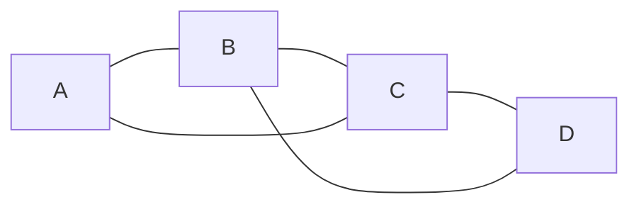
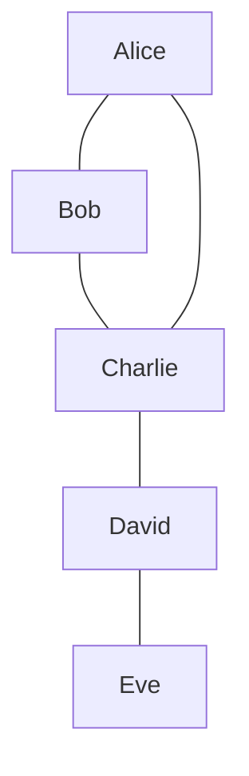
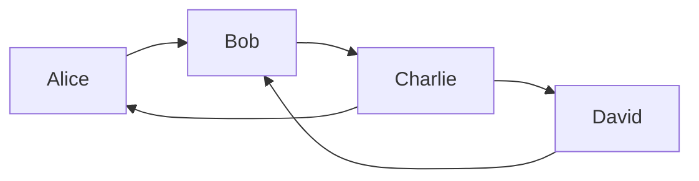
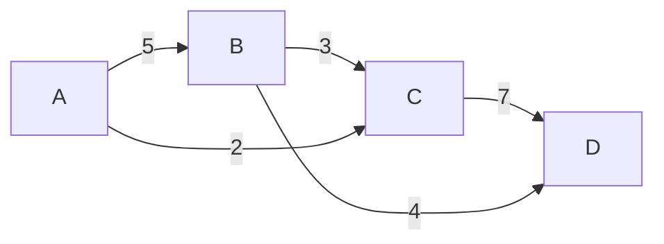
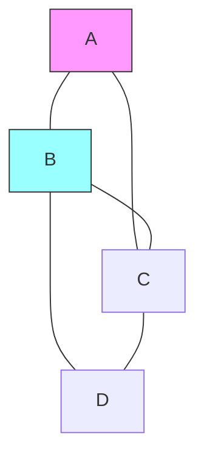
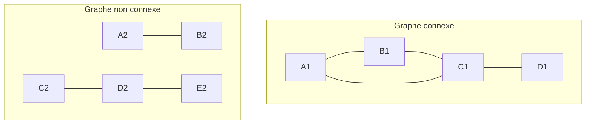

# 🔥 Rapport Theorie des graphes

# 📚 Table of Contents

1. [📖 Définition et Terminologie](#-définition-et-terminologie)
2. [🌍 Histoire du pont de Koenigsberg](#-histoire-du-pont-de-koenigsberg)
3. [📜 Propriété des Graphes](#-propriété-des-graphes)
4. [🔥 Implémentation des Graphes](#-implémentation-des-graphes)

---

## 📖 Définition et Terminologie

### 1. Définition formelle d'un graphe

Un **graphe** est un couple $G = (V, E)$ où :

- **$V$** est un ensemble fini non vide de **sommets** (aussi appelés **nœuds**).
- **$E$** est un ensemble de **paires** de sommets appelées **arêtes** (ou **liens**).

#### Formulations mathématiques

Selon la nature du graphe, l'ensemble $E$ se définit comme suit :

- **Pour un graphe non orienté :** l'ordre des sommets n'importe pas.
  $$E \subseteq \{\{u, v\} \mid u, v \in V \text{ et } u \neq v\}$$

- **Pour un graphe orienté :** les arêtes sont des couples ordonnés (arcs).
  $$E \subseteq \{(u, v) \mid u, v \in V \text{ et } u \neq v\}$$

### Exemple schématique d'un graphe simple

### 2. Types de graphes

#### Graphe non orienté

Dans un graphe non orienté, les arêtes n'ont pas de direction (la relation est symétrique).

- **Définition :** Si $\{u, v\} \in E$, alors les sommets $u$ et $v$ sont dits **adjacents**.
- **Exemple concret :** Un **réseau social** (comme Facebook), où les liens d'amitié sont mutuels : si A est l'ami de B, alors B est nécessairement l'ami de A.

#### B. Graphe orienté

À l'inverse, dans un graphe orienté, les liens (appelés arcs) ont un sens précis.

- **Définition :** Un arc est un couple $(u, v)$ où $u$ est l'origine et $v$ la destination.
- **Exemple concret :** Le réseau **X (Twitter)** ou **Instagram** : l'utilisateur A peut suivre l'utilisateur B sans que B ne suive forcément A.

#### Exemple : Relations de suivis sur Twitter

### 3. Notions fondamentales

#### Sommet (Nœud)

L'élément de base du graphe, généralement représenté par un point ou un cercle étiqueté.

#### Arête (Lien)

Représente la relation entre deux sommets. On distingue trois types principaux :

1. **Non orientée** : Notée $\{u, v\}$. La relation est bidirectionnelle.
2. **Orientée** : Notée $(u, v)$. On l'appelle souvent un **arc**, où $u$ est la source et $v$ la destination.
3. **Pondérée** : Notée avec une fonction de poids $w(u, v)$.

#### Poids (Coût)

Valeur numérique associée à une arête. Elle peut représenter :

- **Une distance** (ex: kilomètres entre deux villes).
- **Un coût** (ex: prix d'un billet de transport).
- **Une capacité** (ex: débit d'une connexion réseau).
- **Un temps** (ex: durée d'un trajet).

#### Exemple de graphe pondéré :

#### Degré d'un sommet

- Degré (graphe non orienté) : Nombre d'arêtes incidentes au sommet

- Degré entrant (graphe orienté) : Nombre d'arêtes arrivant au sommet

- Degré sortant (graphe orienté) : Nombre d'arêtes partant du sommet

##### Exemple:

- Sommet A : degré = 2

- Sommet B : degré = 3

#### Connexité

Un graphe est dit **connexe** si pour toute paire de sommets $(u, v)$, il existe au moins un chemin reliant $u$ à $v$. En d'autres termes, le graphe est "en un seul morceau".

##### Cas particuliers

- **Composante connexe** : Dans un graphe non connexe, chaque sous-ensemble de sommets "reliés" entre eux forme une composante connexe.
- **Forte connexité (Graphes orientés)** :
  - Un graphe orienté est **fortement connexe** s'il existe un chemin entre n'importe quel couple $(u, v)$ en respectant le sens des flèches.
  - S'il n'est connexe qu'en ignorant la direction des arcs, on dit qu'il est **faiblement connexe**.

#### Exemples :

