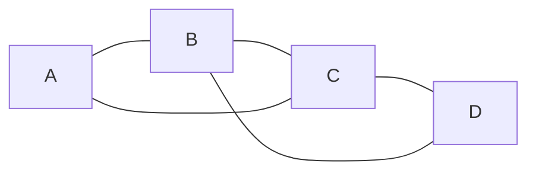
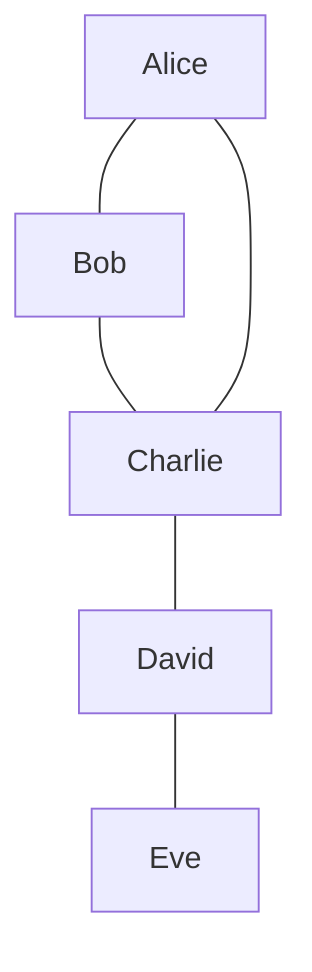
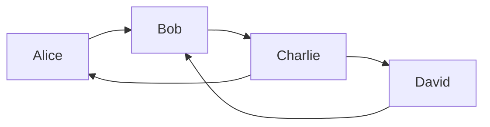
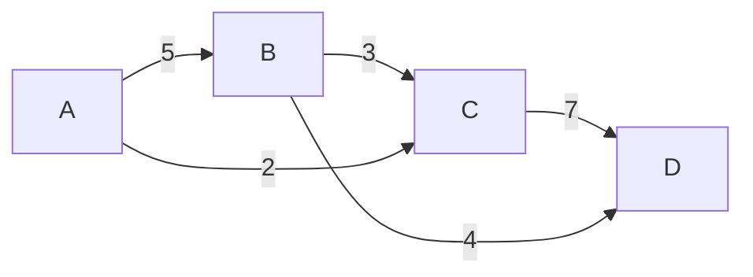
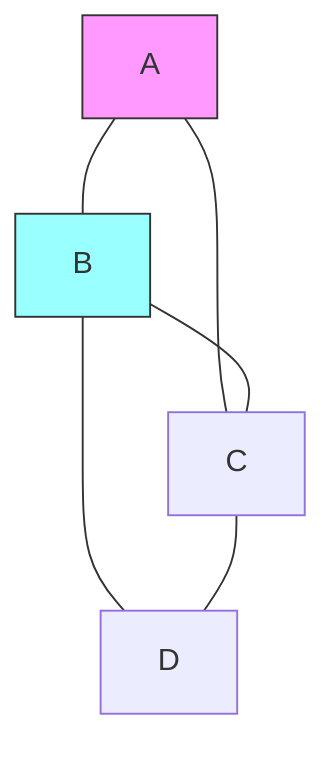
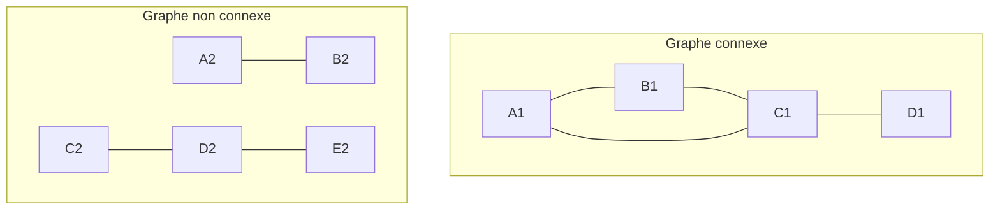
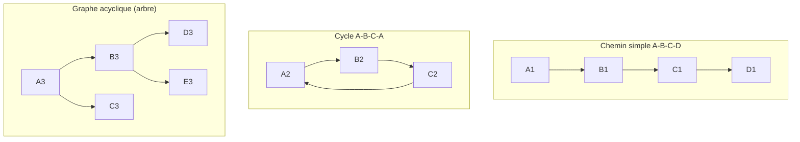
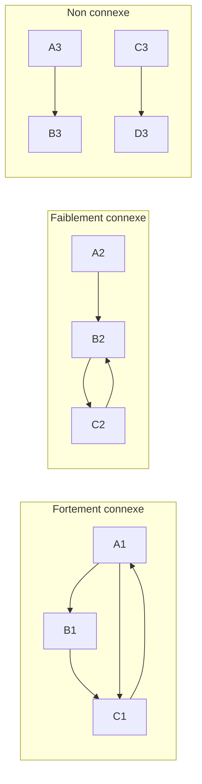

# 🔥 Rapport Theorie des graphes

# 📚 Table of Contents

0. [Genèse de la théorie des graphes](#0-genèse-de-la-théorie-des-graphes)
1. [Définition formelle d'un graphe](#1-définition-formelle-dun-graphe)
2. [Types de graphes](#2-types-de-graphes)
3. [Notions fondamentales](#3-notions-fondamentales)
4. [Classification selon la densité](#4-classification-selon-la-densité)
5. [Importance et applications des graphes](#5-importance-et-applications-des-graphes)
6. [Propriétés mathématiques des graphes](#6-propriétés-mathématiques-des-graphes)
7. [Chemins et connectivité](#7-chemins-et-connectivité)
8. [Types de connectivité](#8-types-de-connectivité)
9. [Implémentations des graphes](#9-implémentations-des-graphes)
10. [Résumé des Complexités](#10-résumé-des-complexités)

---

## 0. Genèse de la théorie des graphes

### L'origine de la Théorie des Graphes

L'histoire des **sept ponts de Königsberg** est l'acte de naissance officiel de la théorie des graphes. C'est l'exemple parfait pour comprendre comment un problème physique réel se transforme en un modèle mathématique, puis en algorithme informatique.

---

### L'énigme des Ponts de Königsberg (1736)

À l'époque, la ville de Königsberg (en Prusse) était traversée par la rivière Pregel, qui entourait deux îles. Sept ponts reliaient les quatre zones de terre ferme.

**Le défi des habitants :** Est-il possible de se promener en ville en traversant chaque pont une seule fois et une seule, pour revenir ensuite à son point de départ ?

#### La résolution de Leonhard Euler

Le mathématicien **Leonhard Euler** a compris que la forme des îles et la longueur des ponts n'avaient aucune importance. Seule comptait la **structure des connexions**.

1.  **Modélisation :** Il a remplacé les terres par des **sommets** (points) et les ponts par des **arêtes** (lignes).
2.  **La règle du degré pair :** Il a démontré que pour effectuer un tel trajet (appelé aujourd'hui **cycle eulérien**), chaque sommet doit avoir un **nombre pair d'arêtes** (un degré pair). En effet, chaque fois qu'on entre dans une zone par un pont, on doit impérativement en ressortir par un autre.
3.  **La conclusion :** À Königsberg, les sommets avaient des degrés impairs (3, 3, 3 et 5). Euler a donc prouvé mathématiquement que **le trajet était impossible**.

---

### Le lien avec l'informatique

Pourquoi un informaticien s'intéresse-t-il à une vieille histoire de ponts ? Parce que l'informatique ne traite pas des "objets", mais des **relations entre les objets**.

#### A. L'abstraction (La base de la programmation)

Euler a inventé l'**abstraction**. En ignorant les détails inutiles (météo, couleur des ponts, taille des îles), il a créé un modèle simplifié. C'est exactement ce qu'on fait en programmation : on crée des **structures de données** pour ne garder que les informations pertinentes au problème.

#### B. L'optimisation et les réseaux

Le problème d'Euler est l'ancêtre direct de défis informatiques majeurs :

- **Le routage des paquets :** Comment envoyer des données d'un serveur A à un serveur B par le chemin le plus efficace ?
- **La planification :** Le problème du "Postier Chinois" ou du "Voyageur de Commerce".
- **La gestion des réseaux :** S'assurer qu'aucune zone (fibre optique, électricité) n'est isolée via l'analyse de la connectivité.

#### C. La complexité algorithmique

Euler a montré qu'on pouvait répondre à une question complexe simplement en regardant le **degré des sommets**.

En informatique, cela signifie passer d'un problème "force brute" (tester toutes les combinaisons possibles, ce qui prendrait un temps infini) à un algorithme ultra-rapide en **temps linéaire** $O(n)$.

---

## 1. Définition formelle d'un graphe

Un **graphe** est un couple $G = (V, E)$ où :

- **$V$** est un ensemble fini non vide de **sommets** (aussi appelés **nœuds**).
- **$E$** est un ensemble de **paires** de sommets appelées **arêtes** (ou **liens**).

### Formulations mathématiques

Selon la nature du graphe, l'ensemble $E$ se définit comme suit :

- **Pour un graphe non orienté :** l'ordre des sommets n'importe pas.
  $$E \subseteq \{\{u, v\} \mid u, v \in V \text{ et } u \neq v\}$$

- **Pour un graphe orienté :** les arêtes sont des couples ordonnés (arcs).
  $$E \subseteq \{(u, v) \mid u, v \in V \text{ et } u \neq v\}$$

### Exemple schématique d'un graphe simple



## 2. Types de graphes

### Graphe non orienté

Dans un graphe non orienté, les arêtes n'ont pas de direction (la relation est symétrique).

- **Définition :** Si $\{u, v\} \in E$, alors les sommets $u$ et $v$ sont dits **adjacents**.
- **Exemple concret :** Un **réseau social** (comme Facebook), où les liens d'amitié sont mutuels : si A est l'ami de B, alors B est nécessairement l'ami de A.



### Graphe orienté

À l'inverse, dans un graphe orienté, les liens (appelés arcs) ont un sens précis.

- **Définition :** Un arc est un couple $(u, v)$ où $u$ est l'origine et $v$ la destination.
- **Exemple concret :** Le réseau **X (Twitter)** ou **Instagram** : l'utilisateur A peut suivre l'utilisateur B sans que B ne suive forcément A.

### Exemple : Relations de suivis sur Twitter



## 3. Notions fondamentales

### Sommet (Nœud)

L'élément de base du graphe, généralement représenté par un point ou un cercle étiqueté.

### Arête (Lien)

Représente la relation entre deux sommets. On distingue trois types principaux :

1. **Non orientée** : Notée $\{u, v\}$. La relation est bidirectionnelle.
2. **Orientée** : Notée $(u, v)$. On l'appelle souvent un **arc**, où $u$ est la source et $v$ la destination.
3. **Pondérée** : Notée avec une fonction de poids $w(u, v)$.

### Poids (Coût)

Valeur numérique associée à une arête. Elle peut représenter :

- **Une distance** (ex: kilomètres entre deux villes).
- **Un coût** (ex: prix d'un billet de transport).
- **Une capacité** (ex: débit d'une connexion réseau).
- **Un temps** (ex: durée d'un trajet).

### Exemple de graphe pondéré :



### Degré d'un sommet

- Degré (graphe non orienté) : Nombre d'arêtes incidentes au sommet

- Degré entrant (graphe orienté) : Nombre d'arêtes arrivant au sommet

- Degré sortant (graphe orienté) : Nombre d'arêtes partant du sommet

### Exemple:



- Sommet A : degré = 2

- Sommet B : degré = 3

### Connexité

Un graphe est dit **connexe** si pour toute paire de sommets $(u, v)$, il existe au moins un chemin reliant $u$ à $v$. En d'autres termes, le graphe est "en un seul morceau".

#### Cas particuliers

- **Composante connexe** : Dans un graphe non connexe, chaque sous-ensemble de sommets "reliés" entre eux forme une composante connexe.
- **Forte connexité (Graphes orientés)** :
  - Un graphe orienté est **fortement connexe** s'il existe un chemin entre n'importe quel couple $(u, v)$ en respectant le sens des flèches.
  - S'il n'est connexe qu'en ignorant la direction des arcs, on dit qu'il est **faiblement connexe**.

#### Exemples :



## 4. Classification selon la densité

La densité d'un graphe mesure le rapport entre le nombre d'arêtes existantes et le nombre d'arêtes possibles.

### Graphe dense

Un graphe est dit **dense** si le nombre d'arêtes $|E|$ est proche du maximum théorique possible.

- **Non orienté :** $|E| \approx \frac{|V|(|V|-1)}{2}$
- **Orienté :** $|E| \approx |V|(|V|-1)$
- **Exemple :** Un réseau de métro complet où chaque station serait reliée à toutes les autres.
- **Structure recommandée :** La **Matrice d'adjacence** est souvent plus efficace ici.

### Graphe clairsemé (Sparse)

Un graphe est **clairsemé** (ou _sparse_) s'il possède très peu d'arêtes par rapport au maximum possible.

- **Condition :** $|E| \ll |V|^2$
- **Exemple :** Un arbre généalogique ou un réseau routier intercontinental (une ville n'est reliée qu'à ses voisines directes).
- **Structure recommandée :** La **Liste d'adjacence** est largement préférable pour économiser de la mémoire.

## 5. Importance et applications des graphes

Les graphes sont des structures de données fondamentales utilisées pour modéliser des systèmes complexes dans de nombreux domaines :

### 🌐 Réseaux sociaux

- **Sommets :** Utilisateurs.
- **Arêtes :** Relations d'amitié, abonnements (followers).
- **Applications :** Algorithmes de recommandation d'amis, détection de communautés, analyse d'influence.

### 🚗 Réseaux de transport

- **Sommets :** Villes, stations de métro, intersections.
- **Arêtes :** Routes, voies ferrées, lignes aériennes.
- **Poids :** Distances, temps de trajet, coût du carburant.
- **Applications :** Calcul d'itinéraire optimal (ex: **Algorithme de Dijkstra** utilisé par Google Maps).

### 💻 Le Web (World Wide Web)

- **Sommets :** Pages web.
- **Arêtes :** Liens hypertextes (graphe orienté).
- **Applications :** Classement des résultats de recherche (ex: algorithme **PageRank** de Google).

### ⚡ Circuits électroniques

- **Sommets :** Composants (transistors, résistances).
- **Arêtes :** Connexions électriques.
- **Applications :** Vérification de la continuité des circuits, optimisation du placement-routage sur les puces.

### 🧬 Biologie et Médecine

- **Sommets :** Protéines, gènes, molécules.
- **Arêtes :** Interactions biologiques, réactions chimiques.
- **Applications :** Analyse de réseaux protéiques, compréhension de la propagation des maladies.

## 6. Propriétés mathématiques des graphes

### Lemme des poignées de mains

Dans tout graphe non orienté, la somme des degrés de tous les sommets est égale au double du nombre d'arêtes :

$$\sum_{v \in V} \deg(v) = 2|E|$$

- **Conséquence :** Dans n'importe quel graphe, le nombre de sommets de degré impair est toujours **pair**.

### Inégalités fondamentales

Pour un graphe simple comportant $n$ sommets et $m$ arêtes :

- **Graphe non orienté :** $0 \leq m \leq \frac{n(n-1)}{2}$
- **Graphe orienté :** $0 \leq m \leq n(n-1)$

---

### Coloration et Nombre chromatique

Le **nombre chromatique**, noté $\chi(G)$, est le plus petit nombre de couleurs nécessaires pour colorer les sommets d'un graphe de telle sorte que deux sommets adjacents n'aient jamais la même couleur.

### Théorème des quatre couleurs

C'est l'un des résultats les plus célèbres de la théorie des graphes :

> Toute carte plane (ou graphe planaire) peut être colorée avec **4 couleurs** au maximum, de façon à ce que deux régions (ou sommets) adjacentes soient de couleurs distinctes.

## 7. Chemins et connectivité

### Chemin

Une séquence de sommets $(v_1, v_2, \dots, v_k)$ telle que chaque paire successive $(v_i, v_{i+1})$ est une arête du graphe pour tout $1 \leq i < k$.

- **Longueur du chemin :** Nombre d'arêtes qui le composent ($k-1$).

### Chemin simple

Un chemin où **tous les sommets sont distincts**. Il ne repasse jamais par le même point.

### Trail (Traînée)

Un chemin où **toutes les arêtes sont distinctes**. Les sommets peuvent se répéter, mais on n'emprunte jamais deux fois le même lien.

### Cycle

Un chemin qui commence et se termine au même sommet ($v_1 = v_k$), avec au moins une arête, et où tous les sommets intermédiaires sont distincts.

### Graphe acyclique

Un graphe qui ne contient **aucun cycle**.

- **Note :** Un graphe non orienté, connexe et acyclique est appelé un **Arbre**.

### Exemples :



## 8. Types de connectivité

La connectivité définit à quel point les sommets d'un graphe sont accessibles les uns par rapport aux autres.

### Graphe connexe (Non orienté)

Un graphe non orienté est **connexe** s'il existe au moins un chemin entre n'importe quelle paire de sommets $(u, v)$.

### Graphe fortement connexe (Orienté)

Un graphe orienté est dit **fortement connexe** si, pour toute paire de sommets $(u, v)$, il existe :

- Un chemin allant de $u$ vers $v$ **ET**
- Un chemin allant de $v$ vers $u$.
  _(En résumé : on peut aller de n'importe où vers n'importe où en respectant le sens des flèches)._

### Graphe faiblement connexe (Orienté)

Un graphe orienté est **faiblement connexe** si le graphe devient connexe lorsque l'on remplace tous ses arcs orientés par des arêtes non orientées (on ignore le sens des flèches).

### Exemples :



## 9. Implémentations des graphes

Il existe plusieurs façons de représenter un graphe en mémoire. La méthode choisie dépend souvent de la densité du graphe et des algorithmes utilisés.

### Liste d'arêtes (Edge List)

C'est la structure la plus simple : on stocke tous les sommets dans une liste et toutes les relations dans une autre.

**Structure :**

- **Sommets :** Une liste $[v_1, v_2, \dots, v_n]$
- **Arêtes :** Une liste de triplets $(u, v, w)$ où $u$ est la source, $v$ la destination et $w$ le poids.

**Exemple pour un graphe avec les liaisons A-B, B-C, A-C :**

```text
Sommets = [A, B, C]
Arêtes = [
    (A, B),
    (B, C),
    (A, C)
]
```

### Complexités de la Liste d'arêtes

Voici l'analyse des performances pour cette structure de données, où $|V|$ représente le nombre de sommets et $|E|$ le nombre d'arêtes :

| Opération                                     | Complexité (Big O) |
| :-------------------------------------------- | :----------------- |
| **Espace mémoire**                            | $O(V + E)$         |
| **Vérifier l'existence d'une arête $(u, v)$** | $O(E)$             |
| **Parcourir les voisins d'un sommet $u$**     | $O(E)$             |
| **Ajouter une arête**                         | $O(1)$ (amorti)    |

> **Note :** Cette implémentation est très économe en mémoire pour les graphes **creux** (peu d'arêtes), mais elle est inefficace pour les recherches fréquentes de connexions, car il faut parcourir toute la liste des arêtes au pire des cas.

### Matrice d'adjacence

La matrice d'adjacence est un tableau à deux dimensions de taille $n \times n$, où $n = |V|$ (le nombre de sommets).

- **Principe :** Chaque case $M[i][j]$ contient :
  - **1** s'il existe une arête du sommet $i$ au sommet $j$.
  - **0** sinon.
- **Poids :** Pour un graphe pondéré, on remplace le "1" par le poids $w$ de l'arête (et souvent "0" par $\infty$ pour indiquer l'absence de chemin).

### Exemple :

Pour un graphe simple non orienté avec 3 sommets (A, B, C) et les arêtes A-B et B-C :

$$
M = \begin{pmatrix}
 & A & B & C \\
A & 0 & 1 & 0 \\
B & 1 & 0 & 1 \\
C & 0 & 1 & 0
\end{pmatrix}
$$

### Complexités de la Matrice d'adjacence

Voici l'analyse des performances pour cette structure de données :

| Opération                                     | Complexité (Big O) |
| :-------------------------------------------- | :----------------- |
| **Espace mémoire**                            | $O(V^2)$           |
| **Vérifier l'existence d'une arête $(u, v)$** | $O(1)$             |
| **Parcourir les voisins d'un sommet $u$**     | $O( V )$           |
| **Ajouter une arête**                         | $O(1)$             |

[Image comparing adjacency matrix and edge list performance]

> **Note :** La matrice d'adjacence est extrêmement rapide pour vérifier si deux sommets sont connectés. Cependant, elle consomme beaucoup de mémoire si le graphe comporte peu d'arêtes (graphe creux), car elle réserve de l'espace pour toutes les connexions possibles.

### Liste d'adjacence

C'est un tableau (ou un dictionnaire) de taille $|V|$, où chaque case indexée par un sommet contient une liste de ses voisins directs.

**Structure :**

- On associe à chaque sommet $u$ une liste chaînée ou un tableau dynamique.
- Si le graphe est pondéré, on stocke des couples `(voisin, poids)` dans la liste.

### Exemple :

Pour un graphe avec les sommets A, B, C et les arêtes A-B et B-C :

- **A** : [B]
- **B** : [A, C]
- **C** : [B]

### Complexités de la Liste d'adjacence

La liste d'adjacence est souvent considérée comme le meilleur compromis pour la plupart des algorithmes de graphes. Voici ses performances :

| Opération                              | Complexité (Big O) |
| :------------------------------------- | :----------------- |
| **Espace mémoire**                     | $O(V + E)$         |
| **Vérifier si $(u, v)$ est une arête** | $O(\deg(u))$       |
| **Parcourir les voisins de $u$**       | $O(\deg(u))$       |
| **Ajouter une arête**                  | $O(1)$ (amorti)    |

> **Note :** $\deg(u)$ représente le degré du sommet $u$. Cette structure est particulièrement efficace pour les graphes **creux** (peu d'arêtes), car les opérations de voisinage ne dépendent que du nombre de voisins réels et non du nombre total de sommets $|V|$.

### Pourquoi c'est l'implémentation la plus utilisée ?

Elle offre le meilleur compromis entre l'espace et la vitesse pour les algorithmes comme le parcours en largeur (BFS) ou en profondeur (DFS).

## 10. Résumé des Complexités

Ce tableau compare les performances des trois principales méthodes de représentation des graphes, où $n = |V|$ (nombre de sommets) et $m = |E|$ (nombre d'arêtes).

| Opération                        | Matrice d'Adjacence | Liste d'Adjacence | Liste d'Arêtes |
| :------------------------------- | :-----------------: | :---------------: | :------------: |
| **Espace Mémoire**               |      $O(n^2)$       |    $O(n + m)$     |     $O(m)$     |
| **Ajouter un sommet**            |      $O(n^2)$       |      $O(1)$       |     $O(1)$     |
| **Ajouter une arête**            |       $O(1)$        |      $O(1)$       |     $O(1)$     |
| **Vérifier une arête $(u, v)$**  |       $O(1)$        |   $O(\deg(u))$    |     $O(m)$     |
| **Parcourir les voisins de $u$** |       $O(n)$        |   $O(\deg(u))$    |     $O(m)$     |

> **Légende :**
>
> - $n$ : Nombre de sommets.
> - $m$ : Nombre d'arêtes.
> - $\deg(u)$ : Degré du sommet $u$ (nombre de ses voisins).
